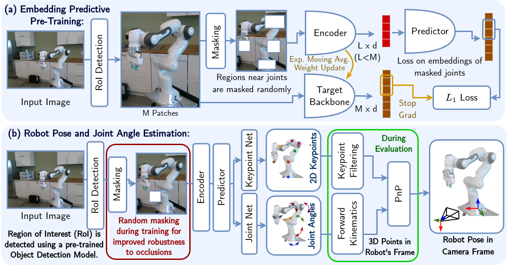
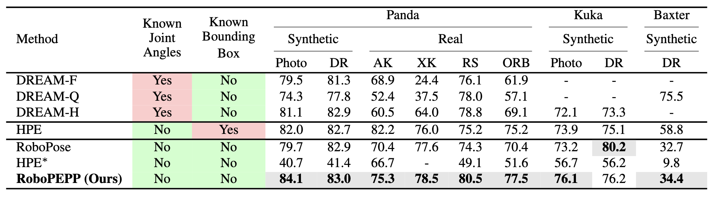
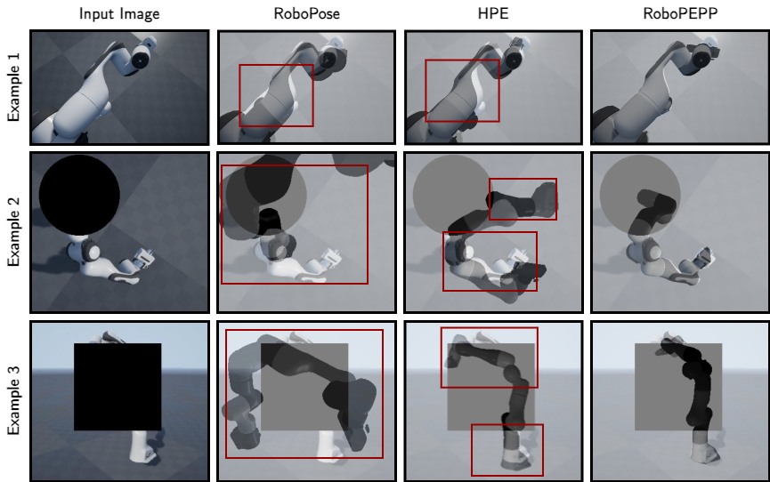

# RoboPEPP: Vision-Based Robot Pose and Joint Angle Estimation through Embedding Predictive Pre-Training
## CVPR 2025 (Highlight)
📖 Paper: To appear in the IEEE/CVF Conference on Computer Vision and Pattern Recognition (CVPR) 2025  
📖 Pre-print: [https://arxiv.org/abs/2411.17662](https://arxiv.org/abs/2411.17662)  
📹 Video: [https://youtu.be/pbM60-kHSdE](https://youtu.be/pbM60-kHSdE)

**Authors:** Raktim Gautam Goswami<sup>1</sup>, Prashanth Krishnamurthy<sup>1</sup>, Yann LeCun<sup>2,3</sup>, Farshad Khorrami<sup>1</sup>  
<sup>1</sup> New York University Tandon School of Engineering  
<sup>2</sup> New York University Courant Institute of Mathematical Sciences  
<sup>3</sup> Meta-FAIR

### 💡 RoboPEPP Contributions
- **Pre-Training**: A robot pose and joint angle estimation framework with embedding-predictive pre-training to enhance the network’s understanding of the robot’s physical model.
- **Fine-Tuning**: An efficient network for robot pose and joint angle estimation using the pre-trained encoder-predictor alongside joint angle and keypoint estimators, trained using randomly masked inputs to enhance occlusion robustness
- **Keypoint Filtering**: A confidence-based keypoint filtering method to handle cases where only part of the robot is visible in the image
- **Experiments**: Extensive experiments showing RoboPEPP’s superior pose estimation, joint angle prediction, occlusion robustness, and computational efficiency.

<center>

<p>Fig. 1: Overview of our RoboPEPP framework.</p>
</center>

## 🔨 Environment creation   
```
conda create --name robopepp python=3.10
conda activate robopepp
pip install -r requirements.txt
export CUDA_HOME=/path/to/cuda/cuda-12.2/
pip install -v "git+https://github.com/facebookresearch/pytorch3d.git@stable"
```

**Note:**  
Before running the code, you may need to configure `accelerate` and log in to `wandb`.  
If you prefer not to use them, you can disable them in the configuration files in `config` folder by setting their values to `false`.


## 📊💾 Dataset Download

RoboPEPP uses the [DREAM dataset](https://drive.google.com/drive/folders/1uNK2n9wU4tRE07sM_r640wDhwmOwuxx6).  
Please download the dataset and place it in a dedicated folder on your system.

Additionally, download the required [URDF files](https://drive.google.com/drive/folders/17KNhy28pypheYfDCxgOjJf4IyUnOI3gW). The urdf files are already in the repository in the `urdf` folder.

**Before training**, make sure to update the dataset root path and URDF file path in the appropriate configuration files located in the `config` folder.

## ✈️ Training

As outlined in the manuscript, RoboPEPP undergoes a two-stage training process:

1. **Embedding Predictive Pre-Training** for the encoder-predictor.
2. **End-to-End Fine-Tuning** of the full model.

### Embedding Predictive Pre-Training

To perform embedding predictive pre-training, follow the instructions provided [here](ijepa/README.md).

Alternatively, you can skip this step and use our [pre-trained weights](https://drive.google.com/drive/folders/1xCppvmG4Koh-pYmcl5P-YZG64LTEvRSd?usp=sharing) directly.

### End-to-end Fine-Tuning
Before End-to-end Fine-Tuning, update the location of the pre-trained model from the above in the configuration file.
```
mkdir checkpoints
accelerate launch train.py --config <path-to-config-file>
# example
accelerate launch train.py --config configs/panda.yaml
```
This will train the model end-to-end and save the weights in the `checkpoints/` folder. The pre-trained weights are available [here](https://drive.google.com/drive/folders/1xCppvmG4Koh-pYmcl5P-YZG64LTEvRSd?usp=sharing).

### Evaluation
During testing, we leverage the GroundingDINO framework from the [Grounded-SAM-2](https://github.com/IDEA-Research/Grounded-SAM-2) repository to predict bounding boxes. While our test pipeline supports real-time bounding box prediction, we recommend pre-processing the test dataset using the steps [here](bbox_grounding_dino/README.md). This enables faster testing.


Run the test code using the trained weights as follows
```
python test.py --config <path-to-config-file>
```
This will evaluate the model on the `test_seq` specified in your config file, and print metrics including ADD AUC, PCK, and Joint Error. If evaluating the sim-to-real fine-tuned models, change the `checkpoint_name` in the config file to the correct .pt file (e.g., robopepp_ssl_realsense.pt)


### Sim-to-Real Fine-Tuning
RoboPEPP also supports self-supervised Sim-to-Real fine-tuning for real-world sequences in the Panda dataset.

This process adapts the model to the real world sequence specified by `s2r_seq` in the configuration file.
```
accelerate launch train_s2r.py --config configs/panda.yaml
```
This will fine-tune the model and store the updated weights in the `checkpoints/` directory.

## 📝 Results
<center>

<p>Table 1: Comparison of robot pose estimation using AUC on the ADD metric. Best values among methods using unknown joint angles and bounding boxes during evaluation are bolded. HPE∗ denotes HPE [4] evaluated with the same off-the-shelf bounding box detector as RoboPEPP.</p>
</center>
<center>

<p>Fig. 2: Qualitative Comparison on Panda Photo (Example 1) and Occlusion (Example 2 and 3) datasets: Predicted poses and joint angles are used to generate a mesh overlaid on the original image, where closer alignment indicates greater accuracy. Highlighted rectangles indicate regions where other methods’ meshes misalign, while RoboPEPP achieves high precision.</p>
</center>

## 📧 Citation
```bibtex